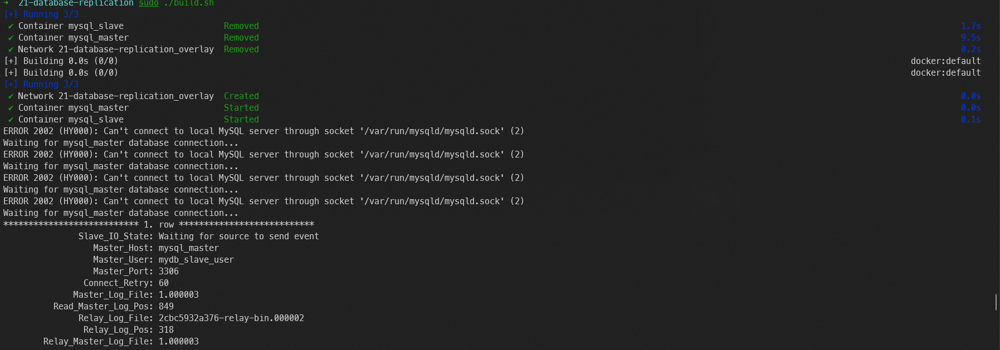
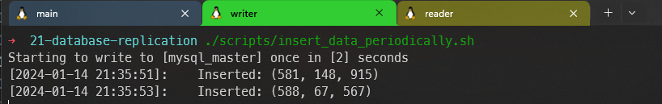
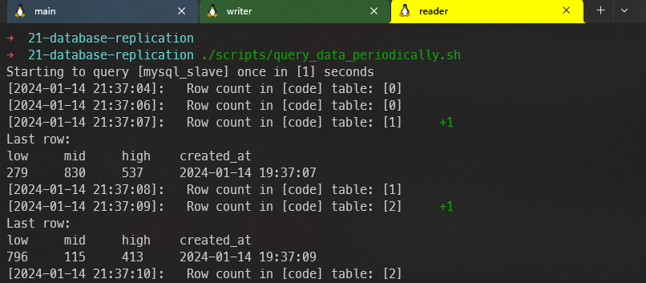
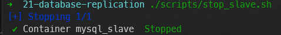
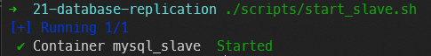
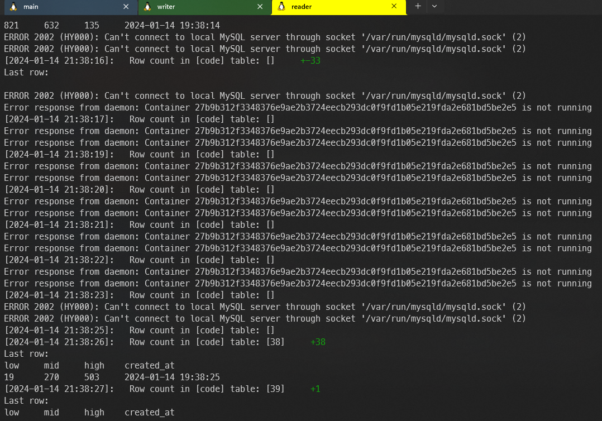
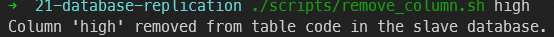
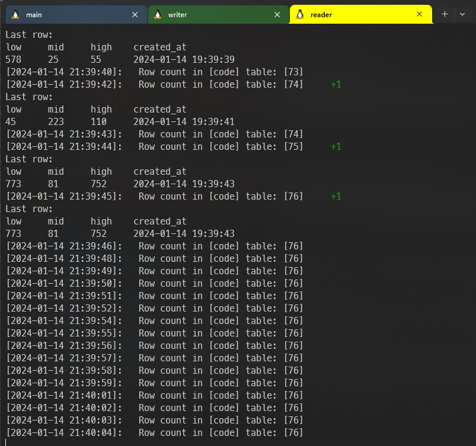

# Database Replication Project

## Overview
This project sets up a MySQL Master-Slave replication using Docker. The setup includes scripts for creating tables, inserting data, and querying the database. The objective is to demonstrate database replication, fault tolerance, and schema modification impacts.

## Setup Instructions
1. **Building the Docker Images**
   - Run `./build.sh` to build the necessary Docker images.
   - 

2. **Creating the Table**
   - Execute `./scripts/create_table.sh` to create the required table in the database.

3. **Testing Replication**
   - Run `./scripts/insert_data_periodically.sh` to insert data into the master database.
   - Simultaneously, run `./scripts/query_data_periodically.sh` to query data from the slave database.
   - 
   - 

4. **Testing Fault Tolerance**
   - Execute `./scripts/stop_slave.sh` to stop the slave service.
   - Later, restart it using `./scripts/start_slave.sh`.
   - Observe if the slave catches up after resuming.
   - 
   - 
   - 

5. **Schema Modification Impact**
   - Run `./scripts/remove_column.sh` to remove a column from the slave database.
   - Check the behavior of new rows insertion and replication.
   - 
   - 

## Conclusions
- **Replication Efficacy:** The setup successfully demonstrated MySQL Master-Slave replication. Data inserted into the master database was accurately and consistently replicated to the slave database. This confirms the effectiveness of MySQL's replication capabilities in synchronizing data across multiple instances.
- **Fault Tolerance:**  The test involving stopping and restarting the slave database showed notable resilience. Upon resumption, the slave successfully caught up with the master, syncing all missed transactions. This highlights the robust fault tolerance inherent in MySQL's replication setup, ensuring data consistency even after temporary downtimes.
- **Schema Changes:** Removing a column from the slave database had a significant impact. While the master continued to operate normally, the slave encountered issues with replicating new rows post-modification, indicating a critical dependency on schema consistency for replication process. This underscores the importance of careful schema management in replicated database environments.
